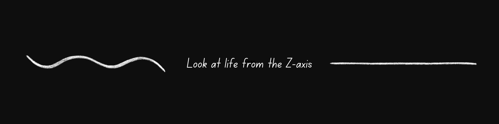

# Hi there, I'm Naufil Asar 👋

## Who am I? 👨‍💻

- 🎓 Computer Science Engineering student at Sardar Patel Institute of Technology, Mumbai
- ⚓ Former Jr. Software Engineer in the Indian Navy
- 🐧 Linux enthusiast and NeoVim power user
- 🛠️ Always customizing my setup for maximum productivity
- 📚 Passionate about contributing to Open Source Projects

## 📫 Socials 👇

## 🔧 Technologies & Tools

## 💼 Experience

- **Indian Navy** - Jr. Software Engineer
  - Developed and maintained mission-critical software systems
  - Collaborated with cross-functional teams to improve operational efficiency

<!-- 
 
  

 -->

  

